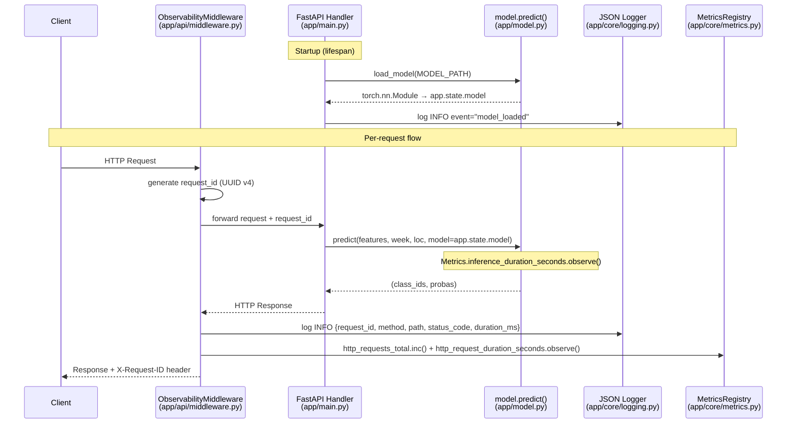

# Дизайн: M1 — Ship And Observe

## Обзор

Майлстоун M1 переводит `crop-ml-api` из состояния «работает локально» в состояние «готов к деплою и наблюдаем». Изменения затрагивают четыре области:

1. **Надёжный старт** — FastAPI lifespan загружает модель в `app.state` до первого запроса; ошибка загрузки немедленно завершает процесс.
2. **Структурированные JSON-логи** — каждый запрос получает UUID v4 (`request_id`), все записи лога — валидный JSON в stdout.
3. **Prometheus-метрики** — счётчики и гистограммы HTTP и инференса, эндпоинт `GET /metrics`.
4. **Контейнеризация** — `Dockerfile` (non-root, CPU-only torch, uv) и `docker-compose.yml` для локального запуска.

Prediction contract (`POST /predict`, схемы `PredictRequest`/`PredictResponse`) не меняется.

---

## Архитектура

### Структура файлов (новые и изменённые)

```
crop-ml-api/
├── app/
│   ├── core/
│   │   ├── __init__.py          # новый
│   │   ├── logging.py           # новый — JSON-форматтер, настройка логгера
│   │   └── metrics.py           # новый — Prometheus-реестр, метрики
│   ├── api/
│   │   ├── __init__.py          # новый
│   │   └── middleware.py        # новый — ASGI-middleware (logging + metrics)
│   ├── main.py                  # изменён — lifespan, подключение middleware
│   ├── model.py                 # изменён — убран lru_cache, добавлен load_model()
│   ├── schemas.py               # без изменений
│   ├── hls_preprocess.py        # без изменений
│   └── sample.py                # без изменений
├── tests/
│   ├── test_api.py              # без изменений (существующие тесты)
│   ├── test_preprocess.py       # без изменений
│   ├── test_schemas.py          # без изменений
│   ├── test_health.py           # новый — health endpoint + X-Request-ID
│   └── test_predict_contract.py # новый — fixture regression + proba finite
├── Dockerfile                   # новый
├── docker-compose.yml           # новый
├── pyproject.toml               # изменён — добавлен prometheus-client
└── README.md                    # изменён — раздел с командами
```

### Диаграмма взаимодействия компонентов



---

## Компоненты и интерфейсы

### `app/core/logging.py`

Настраивает корневой логгер Python с JSON-форматтером. Использует стандартную библиотеку `logging` + `python-json-logger` (пакет `pythonjsonlogger`).

```python
import logging
import os
from pythonjsonlogger import jsonlogger

def configure_logging() -> None:
    """Настраивает корневой логгер: JSON в stdout, уровень из LOG_LEVEL."""
    level_name = os.getenv("LOG_LEVEL", "info").upper()
    level = getattr(logging, level_name, logging.INFO)

    handler = logging.StreamHandler()
    formatter = jsonlogger.JsonFormatter(
        fmt="%(asctime)s %(name)s %(levelname)s %(message)s",
        rename_fields={"levelname": "level", "asctime": "timestamp"},
    )
    handler.setFormatter(formatter)

    root = logging.getLogger()
    root.handlers.clear()
    root.addHandler(handler)
    root.setLevel(level)

def get_logger(name: str) -> logging.Logger:
    return logging.getLogger(name)
```

**Ключевые решения:**
- `python-json-logger` вместо самописного форматтера — зрелая библиотека, поддерживает произвольные extra-поля.
- `rename_fields` приводит `levelname` → `level` и `asctime` → `timestamp` для единообразия с соглашениями JSON-логирования.
- `configure_logging()` вызывается один раз в lifespan до старта обработки запросов.

---

### `app/core/metrics.py`

Создаёт Prometheus-реестр и экспортирует метрики. Использует `prometheus-client`.

```python
from prometheus_client import CollectorRegistry, Counter, Histogram, generate_latest, CONTENT_TYPE_LATEST

registry = CollectorRegistry()

http_requests_total = Counter(
    "http_requests_total",
    "Total HTTP requests",
    labelnames=["method", "path", "status_code"],
    registry=registry,
)

http_request_duration_seconds = Histogram(
    "http_request_duration_seconds",
    "HTTP request duration in seconds",
    labelnames=["method", "path"],
    registry=registry,
)

inference_duration_seconds = Histogram(
    "inference_duration_seconds",
    "Model inference duration in seconds",
    registry=registry,
)
```

**Ключевые решения:**
- Используется явный `CollectorRegistry()` вместо глобального `REGISTRY` — изолирует метрики приложения от системных метрик `prometheus-client` и упрощает тестирование (каждый тест может создать свой реестр).
- `inference_duration_seconds` без меток — инференс всегда один тип операции.
- Бакеты гистограмм — дефолтные (`.005, .01, .025, .05, .1, .25, .5, 1, 2.5, 5, 10`), достаточны для ML-инференса на CPU.

---

### `app/api/middleware.py`

ASGI-middleware, объединяющий логирование и метрики.

```python
import time
import uuid
import logging
from starlette.middleware.base import BaseHTTPMiddleware
from starlette.requests import Request
from starlette.responses import Response
from app.core.metrics import (
    http_requests_total,
    http_request_duration_seconds,
)

logger = logging.getLogger(__name__)

EXCLUDED_PATHS = {"/metrics"}

class ObservabilityMiddleware(BaseHTTPMiddleware):
    async def dispatch(self, request: Request, call_next) -> Response:
        request_id = str(uuid.uuid4())
        start = time.perf_counter()

        try:
            response = await call_next(request)
            status_code = response.status_code
        except Exception as exc:
            logger.error(
                "Unhandled exception",
                extra={
                    "request_id": request_id,
                    "exc_type": type(exc).__name__,
                    "exc_message": str(exc),
                },
            )
            raise

        duration_ms = (time.perf_counter() - start) * 1000

        logger.info(
            "request",
            extra={
                "request_id": request_id,
                "method": request.method,
                "path": request.url.path,
                "status_code": status_code,
                "duration_ms": round(duration_ms, 2),
            },
        )

        if request.url.path not in EXCLUDED_PATHS:
            http_requests_total.labels(
                method=request.method,
                path=request.url.path,
                status_code=str(status_code),
            ).inc()
            http_request_duration_seconds.labels(
                method=request.method,
                path=request.url.path,
            ).observe(duration_ms / 1000)

        response.headers["X-Request-ID"] = request_id
        return response
```

**Ключевые решения:**
- `BaseHTTPMiddleware` из Starlette — стандартный способ для FastAPI, не требует ручного ASGI-протокола.
- `EXCLUDED_PATHS` — множество путей, исключённых из метрик (только `/metrics`). Логирование для `/metrics` сохраняется.
- `time.perf_counter()` — монотонные часы высокого разрешения, не зависят от системного времени.
- Исключения перехватываются для логирования, затем пробрасываются дальше — FastAPI обрабатывает их штатно.

---

### `app/main.py` (изменения)

```python
from contextlib import asynccontextmanager
import logging
from fastapi import FastAPI, Request
from fastapi.responses import PlainTextResponse
from prometheus_client import generate_latest, CONTENT_TYPE_LATEST

from .core.logging import configure_logging
from .core.metrics import registry, inference_duration_seconds
from .model import load_model, CLASS_NAMES, predict
from .api.middleware import ObservabilityMiddleware
from .sample import make_sample
from .schemas import Prediction, PredictRequest, PredictResponse

logger = logging.getLogger(__name__)

@asynccontextmanager
async def lifespan(app: FastAPI):
    configure_logging()
    app.state.model = load_model()          # FileNotFoundError → процесс падает
    logger.info("model_loaded", extra={"event": "model_loaded", "model_path": str(MODEL_PATH)})
    yield
    # shutdown: ничего не требуется

app = FastAPI(title="Crop Prediction API", version="0.1.0", lifespan=lifespan)
app.add_middleware(ObservabilityMiddleware)

@app.get("/metrics", include_in_schema=False)
def metrics_endpoint():
    return PlainTextResponse(
        generate_latest(registry),
        media_type=CONTENT_TYPE_LATEST,
    )

@app.get("/health")
def health() -> dict:
    return {"status": "ok"}

# ... остальные эндпоинты без изменений, но predict использует app.state.model
```

**Ключевые решения:**
- `lifespan` вместо `on_event("startup")` — рекомендованный способ в FastAPI ≥ 0.93.
- `FileNotFoundError` из `load_model()` не перехватывается — процесс завершается с ненулевым кодом (требование 1.2).
- `configure_logging()` вызывается первым в lifespan — все последующие логи уже в JSON.
- `/metrics` добавлен как обычный эндпоинт FastAPI с `PlainTextResponse` — не требует отдельного ASGI-приложения.

---

### `app/model.py` (изменения)

```python
def load_model() -> torch.nn.Module:
    """Загружает модель с диска. Вызывается один раз в lifespan."""
    if not MODEL_PATH.exists():
        raise FileNotFoundError(f"Model weights not found: {MODEL_PATH}")
    device = torch.device("cuda" if torch.cuda.is_available() else "cpu")
    model = torch.load(MODEL_PATH, map_location=device, weights_only=False)
    model.eval()
    return model

def predict(
    features: Sequence,
    week_of_year: Sequence[int],
    location: Sequence[Sequence[float]],
    model: torch.nn.Module,          # теперь принимает модель явно
) -> Tuple[list[int], list[float]]:
    ...
```

**Ключевые решения:**
- `lru_cache` удалён — модель хранится в `app.state.model`, передаётся явно в `predict()`.
- `load_model()` — чистая функция без кэша, вызывается один раз в lifespan.
- Сигнатура `predict()` расширяется параметром `model` — это делает функцию тестируемой без глобального состояния.

---

## Модели данных

### Структура JSON-лога (запрос)

```json
{
  "timestamp": "2025-01-15T10:23:45.123456",
  "level": "info",
  "name": "app.api.middleware",
  "message": "request",
  "request_id": "550e8400-e29b-41d4-a716-446655440000",
  "method": "POST",
  "path": "/predict",
  "status_code": 200,
  "duration_ms": 142.37
}
```

### Структура JSON-лога (старт модели)

```json
{
  "timestamp": "2025-01-15T10:23:44.000000",
  "level": "info",
  "name": "app.main",
  "message": "model_loaded",
  "event": "model_loaded",
  "model_path": "/app/models/hls_TL_dinner1024_nhead2_nlayers5_260311_1423.pt"
}
```

### Структура JSON-лога (ошибка)

```json
{
  "timestamp": "2025-01-15T10:23:46.000000",
  "level": "error",
  "name": "app.api.middleware",
  "message": "Unhandled exception",
  "request_id": "550e8400-e29b-41d4-a716-446655440000",
  "exc_type": "ValueError",
  "exc_message": "features must reshape to (N, 26, 15)"
}
```

### Prometheus-метрики

| Метрика | Тип | Метки | Описание |
|---|---|---|---|
| `http_requests_total` | Counter | `method`, `path`, `status_code` | Всего HTTP-запросов |
| `http_request_duration_seconds` | Histogram | `method`, `path` | Длительность HTTP-запроса |
| `inference_duration_seconds` | Histogram | — | Длительность инференса модели |

---

## Dockerfile

```dockerfile
# syntax=docker/dockerfile:1
FROM python:3.11-slim AS base

# Установка uv
COPY --from=ghcr.io/astral-sh/uv:latest /uv /usr/local/bin/uv

WORKDIR /app

# Зависимости (кэшируются отдельно от кода)
COPY pyproject.toml uv.lock ./
RUN uv sync --frozen --no-dev

# Исходный код
COPY app/ ./app/
COPY src/ ./src/

# Веса модели (включаются в образ для production)
COPY models/ ./models/

# Non-root пользователь
RUN adduser --system --no-create-home appuser
USER appuser

EXPOSE 8000

CMD ["uv", "run", "uvicorn", "app.main:app", "--host", "0.0.0.0", "--port", "8000"]
```

**Ключевые решения:**
- `python:3.11-slim` — минимальный образ без лишних пакетов (~50 MB base vs ~900 MB full).
- `uv sync --frozen --no-dev` — воспроизводимая установка из `uv.lock`, без dev-зависимостей.
- CPU-only torch index уже прописан в `pyproject.toml` → `uv` использует его автоматически.
- `COPY models/` включает веса в production-образ; для локальной разработки они монтируются через volume в docker-compose.
- `adduser --system` создаёт системного пользователя без shell и домашней директории.
- Однослойная сборка (не multi-stage) — достаточно для Python-приложения; multi-stage оправдан при компиляции C-расширений.

---

## `docker-compose.yml`

```yaml
services:
  api:
    build: .
    ports:
      - "8000:8000"
    volumes:
      - ./models:/app/models:ro
    environment:
      LOG_LEVEL: ${LOG_LEVEL:-info}
    healthcheck:
      test: ["CMD", "curl", "-sf", "http://localhost:8000/health"]
      interval: 10s
      timeout: 5s
      retries: 3
```

**Ключевые решения:**
- `volumes: ./models:/app/models:ro` — монтирует веса из хоста, не включая их в образ при локальной разработке.
- `${LOG_LEVEL:-info}` — переменная окружения с дефолтом `info`.
- `healthcheck` — позволяет `docker compose up --wait` дождаться готовности сервиса.

---

## Свойства корректности

*Свойство — это характеристика или поведение, которое должно выполняться при всех допустимых выполнениях системы. Свойства служат мостом между читаемыми человеком спецификациями и машинно-верифицируемыми гарантиями корректности.*

### Свойство 1: Каждая запись лога — валидный JSON

*Для любого* вызова логгера (info, warning, error) с произвольным сообщением и произвольными extra-полями, строка, выведенная в stdout, должна быть парсируемым JSON-объектом, содержащим поле `level`.

**Validates: Requirements 2.1, 2.4**

---

### Свойство 2: X-Request-ID присутствует в каждом ответе

*Для любого* HTTP-запроса к любому эндпоинту API, ответ должен содержать заголовок `X-Request-ID` со значением, являющимся валидным UUID v4.

**Validates: Requirements 2.2**

---

### Свойство 3: Лог запроса содержит все обязательные поля

*Для любого* HTTP-запроса к любому эндпоинту API, JSON-запись лога, созданная middleware, должна содержать поля `request_id`, `method`, `path`, `status_code`, `duration_ms`.

**Validates: Requirements 2.3**

---

### Свойство 4: Метрики HTTP инкрементируются после каждого запроса

*Для любого* HTTP-запроса к эндпоинту, не являющемуся `/metrics`, счётчик `http_requests_total` должен быть инкрементирован с метками `method`, `path`, `status_code`, соответствующими запросу, а гистограмма `http_request_duration_seconds` должна содержать наблюдение с метками `method`, `path`.

**Validates: Requirements 3.2, 3.3, 3.5**

---

### Свойство 5: Инференс записывает наблюдение в гистограмму

*Для любого* валидного `POST /predict` запроса, гистограмма `inference_duration_seconds` должна содержать хотя бы одно наблюдение после выполнения запроса.

**Validates: Requirements 3.4, 3.6**

---

### Свойство 6: Prediction contract — все вероятности конечны

*Для любого* валидного `PredictRequest` (N ≥ 1, корректные формы тензоров, в том числе с NaN в features), все значения `proba` в `PredictResponse` должны быть конечными числами (не NaN, не Inf).

**Validates: Requirements 6.1, 6.3, 6.4**

---

### Свойство 7: Невалидная форма features возвращает 422

*Для любого* запроса `POST /predict`, в котором форма `features` не соответствует `(N, 26, 15)` (неверное число временных шагов или каналов), API должен вернуть HTTP 422.

**Validates: Requirements 6.5**

---

## Обработка ошибок

| Сценарий | Поведение |
|---|---|
| Файл весов не найден при старте | `FileNotFoundError` не перехватывается → процесс завершается с кодом 1 |
| Необработанное исключение в обработчике | Middleware логирует ERROR с `exc_type`, `exc_message`, `request_id`; исключение пробрасывается → FastAPI возвращает 500 |
| Невалидный `PredictRequest` (422) | Pydantic ValidationError → FastAPI возвращает 422 автоматически; middleware логирует запрос со `status_code=422` |
| `LOG_LEVEL` содержит неизвестное значение | `getattr(logging, level_name, logging.INFO)` → fallback на INFO |
| CUDA недоступна | `torch.device("cpu")` — CPU-only образ, CUDA не ожидается |

---

## Стратегия тестирования

### Подход

Используется двойная стратегия: примерные тесты для конкретных сценариев и property-based тесты для универсальных свойств.

**Property-based testing**: библиотека `hypothesis` (Python). Минимум 100 итераций на каждый property-тест. Каждый тест помечен тегом формата `Feature: m1-ship-observe, Property N: <текст свойства>`.

### Новые тестовые файлы

#### `tests/test_health.py`

- `test_health_returns_ok` — `GET /health` возвращает `{"status": "ok"}` (пример)
- `test_health_has_request_id_header` — ответ содержит заголовок `X-Request-ID` (пример)
- `test_request_id_is_uuid4` — значение `X-Request-ID` — валидный UUID v4 (пример)
- `test_metrics_endpoint_returns_200` — `GET /metrics` возвращает 200 (smoke)
- `test_metrics_content_type` — Content-Type содержит `text/plain` (smoke)

#### `tests/test_predict_contract.py`

- `test_fixture_predict_count` — fixture payload (N=10) возвращает ровно 10 predictions (пример)
- `test_fixture_predict_proba_finite` — все `proba` из fixture конечны (пример)
- `test_predict_422_wrong_timesteps` — неверное число timesteps → 422 (пример)
- `test_predict_422_wrong_channels` — неверное число каналов → 422 (пример)

### Property-based тесты (hypothesis)

**Свойство 1** (`test_logger_output_is_valid_json`):
```python
@given(
    message=st.text(min_size=1),
    extra_fields=st.dictionaries(st.text(min_size=1), st.text())
)
@settings(max_examples=100)
def test_logger_output_is_valid_json(message, extra_fields):
    # Feature: m1-ship-observe, Property 1: каждая запись лога — валидный JSON
    ...
```

**Свойство 2 + 3** (`test_any_request_has_request_id_and_log_fields`):
```python
@given(n=st.integers(min_value=1, max_value=5))
@settings(max_examples=100)
def test_any_request_has_request_id_and_log_fields(n):
    # Feature: m1-ship-observe, Property 2+3: X-Request-ID и поля лога
    ...
```

**Свойство 6** (`test_predict_proba_always_finite`):
```python
@given(
    n=st.integers(min_value=1, max_value=4),
    nan_fraction=st.floats(min_value=0.0, max_value=0.5),
)
@settings(max_examples=100)
def test_predict_proba_always_finite(n, nan_fraction):
    # Feature: m1-ship-observe, Property 6: все proba конечны
    ...
```

**Свойство 7** (`test_wrong_shape_returns_422`):
```python
@given(
    wrong_t=st.integers(min_value=1, max_value=50).filter(lambda x: x != 26),
)
@settings(max_examples=100)
def test_wrong_shape_returns_422(wrong_t):
    # Feature: m1-ship-observe, Property 7: невалидная форма → 422
    ...
```

### Существующие тесты

Все существующие тесты (`test_api.py`, `test_preprocess.py`, `test_schemas.py`) должны продолжать проходить без изменений. Изменение сигнатуры `predict()` (добавление параметра `model`) требует обновления вызовов в `main.py`, но не в тестах (тесты используют HTTP-клиент).

### Зависимости для тестирования

```toml
[dependency-groups]
dev = [
    "httpx>=0.27",
    "pytest>=8.0",
    "hypothesis>=6.100",
    "shapely>=2.1.2",
]
```
