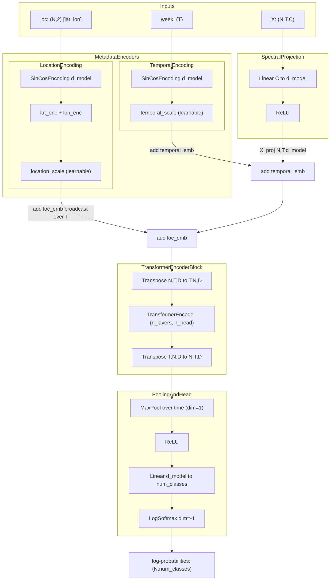

# crop-ml-api

[](LICENSE)

MVP FastAPI inference service for the HLS Transformer crop classifier (Soybean / Corn / Rice / Other).

This iteration covers Week 1 (MVP) only — see [prompts/crop-ml-api_spec.md](prompts/crop-ml-api_spec.md) for the full roadmap (Postgres, Redis, AsyncBatcher, OTel, LLM explainer, Caddy/CI deploy).

## Layout

```
app/
  main.py              # FastAPI app + lifespan warmup + /metrics endpoint
  model.py             # load_model() + predict()
  schemas.py           # Pydantic Request/Response
  sample.py            # random rows from fixtures/rs_hls_predict_request.json
  core/
    logging.py         # JSON structured logging (configure_logging, get_logger)
    metrics.py         # Prometheus registry (http_requests_total, durations)
  api/
    middleware.py      # ObservabilityMiddleware — request_id, logs, metrics
src/models/            # pickle-path mirror so torch.load resolves TransformerModel
models/                # weights (.pt)
prompts/               # source spec + minimal-project spec
```

The `src/models/transformer_model.py` mirror is required because the model
is saved as a full pickle (`torch.load(weights_only=False)`) and embeds the
fully-qualified class path `src.models.transformer_model.TransformerModel`.

## Model weights

Weights (`models/*.pt`) are **not included** in this repository — they are proprietary assets belonging to their respective owners. To run inference locally, obtain the `.pt` file separately and place it in `models/`.

See [NOTICE](NOTICE) for details.

## Run

### Local (uv)

```bash
uv sync
uv run uvicorn app.main:app --reload --port 8000
```

### Docker Compose

```bash
docker compose up --build
```

## Verify

**Health check:**

```bash
curl -sf http://localhost:8000/health
```

Expected: `{"status":"ok"}`

**Fixture contract (expect `10` predictions):**

```bash
curl -sf -X POST -H "Content-Type: application/json" \
  -d @fixtures/rs_hls_predict_request.json http://localhost:8000/predict | jq '.predictions | length'
```

Expected: `10` with all `proba` values finite.

**Prometheus metrics:**

```bash
curl -s http://localhost:8000/metrics | head -20
```

**Demo endpoint:**

```bash
curl -s -X POST http://localhost:8000/predict/demo | jq
```

OpenAPI UI: <http://localhost:8000/docs>.

## Real RS fixtures (NPZ + GPKG)

Regenerate `fixtures/rs_hls_predict_request.json` + `fixtures/rs_hls_fixture_meta.json`
from `research-crops` (Rio Grande do Sul bundle). ``crop_class`` from GPKG is mapped to
eval IDs via ``classmapping_eval.csv``; ``Pasture`` / ``Forest Plantation`` → ``Other`` (2).

```bash
uv sync --group dev
RESEARCH_CROPS_ROOT=/path/to/research-crops uv run python scripts/export_rs_hls_fixtures.py
curl -s -X POST -H "Content-Type: application/json" \
  -d @fixtures/rs_hls_predict_request.json http://localhost:8000/predict | jq
```

## Inputs

`POST /predict`:

- `features`: `(N, T=26, C=15)` raw HLS reflectance (~`[0..10000]`). Missing values (`NaN`) are linearly interpolated along time then ffill/bfill, matching `research-crops` `HLSStitchedDataset`; then multiplied by `0.7e-4`.
- `week_of_year`: `(T=26,)` ISO week per timestep.
- `location`: `(N, 2)` — `[lat, lon]` field centroids.

Returns log-softmax → `class_id` + `class_name` + `proba` per row.

## TL-Transformer architecture

Temporal-Location Transformer: Transformer encoder with additive temporal and location encodings for sequence classification.



## Roadmap

Future iterations from [the spec](prompts/crop-ml-api_spec.md):
Postgres + SQLAlchemy + Alembic, Redis idempotency, `AsyncBatcher`,
OpenTelemetry, structlog, Prometheus `/metrics`, LLM explainer with
prompt versioning + cost tracking + fallback, Caddy + Docker compose,
GitHub Actions CI/CD, load tests.

---

## Milestone plan (fixture contract)

**Regression payload:** [`fixtures/rs_hls_predict_request.json`](fixtures/rs_hls_predict_request.json) — valid `POST /predict` body (`features` `(N,26,15)`, `week_of_year` length 26, `location` `(N,2)`). After each milestone, run:

```bash
curl -sf -X POST -H "Content-Type: application/json" \
  -d @fixtures/rs_hls_predict_request.json http://localhost:8000/predict | jq '.predictions | length'
```

Expect `10` and finite `proba` values. Regenerate fixtures if sources change: `scripts/export_rs_hls_fixtures.py`.

**How many milestones?** For step-by-step skill building, **5–7 checkpoints** total (including “current baseline”) works well: fewer than ~4 lumps unrelated concerns; more than ~8 you spend time on ceremony without shipping integration slices. This repo uses **M0 (now) + M1–M4** aligned with the spec’s four weeks; split a week only if a single PR becomes too large.

Plan-mode prompts:

- [M1 — Ship + observe](prompts/milestone_M1_ship_observe.md)
- [M2 — Persistence + resilience](prompts/milestone_M2_persistence_resilience.md)
- [M3 — Throughput + tracing](prompts/milestone_M3_throughput_tracing.md)
- [M4 — LLM + hardening](prompts/milestone_M4_llm_hardening.md)

### M0 — Baseline (this repo today)

**Done:** FastAPI + `uv`, CPU `torch`, `torch.load` pickle mirror under `src/models/`, `POST /predict` / `/predict/demo` / `/sample`, HLS gap-fill + norm matching `HLSStitchedDataset`, Pydantic shape validation, RS fixtures + export script.

**Skills to deliberately practice on M0 (not “done” until you can explain them):**

| Skill | Why it matters here |
|-------|---------------------|
| **Tensor / JSON shape discipline** | `(N,T,C)` vs broken nesting → was the root of `mat1` shape errors; validators + mental model. |
| **Training vs inference parity** | Interpolate then `0.7e-4` — same order as `research-crops`; know when to re-export fixtures. |
| **`uv` + lockfile** | Repro builds; CPU torch index in `pyproject.toml`. |
| **Contract testing mindset** | Treat `rs_hls_predict_request.json` + OpenAPI as the API boundary; extend with pytest when ready. |

**M0 exit checklist (manual):** `/health` 200; `/predict` with fixture returns 10 predictions; no `NaN` in fixture JSON (`export` uses `allow_nan=False`).

---

### M1 — Ship + observe (spec “Week 1” remainder)

**Done:** Dockerfile (non-root, `python:3.11-slim`, `uv sync --frozen --no-dev`); `docker-compose.yml` with volume-mounted weights, `LOG_LEVEL` env, and healthcheck; FastAPI `lifespan` loads model into `app.state` (fail-fast on missing weights, replaces `lru_cache`); `app/core/logging.py` — JSON structured logs via `python-json-logger`; `app/core/metrics.py` — Prometheus registry with `http_requests_total`, `http_request_duration_seconds`, `inference_duration_seconds`; `app/api/middleware.py` — `ObservabilityMiddleware` adds `X-Request-ID` header, logs every request, records metrics; `GET /metrics` endpoint.

**M1 exit checklist:**

```bash
# Health
curl -sf http://localhost:8000/health

# Fixture contract — expect 10
curl -sf -X POST -H "Content-Type: application/json" \
  -d @fixtures/rs_hls_predict_request.json http://localhost:8000/predict | jq '.predictions | length'

# Metrics
curl -s http://localhost:8000/metrics | head -20

# Docker Compose
docker compose up --build
```

---

### M2 — Persistence + resilience (spec “Week 2”)

**Goal:** Postgres async + SQLAlchemy 2.0, Alembic, store predictions + audit fields; Redis **Idempotency-Key** + rate limit sketch; keep fixture as API contract.

**Plan mode paste:**

```
Milestone M2 crop-ml-api: POST /v1/predict (or keep /predict) persists rows to Postgres async; separate ORM vs Pydantic schemas; Alembic migration; unique idempotency key index.
Redis: Idempotency-Key header required, TTL 24h, body hash; sliding window rate limit per IP optional.
Acceptance: integration test or script: same Idempotency-Key + body returns identical JSON; fixture batch still passes /predict smoke; no N+1 on list endpoint if added.
```

---

### M3 — Throughput + tracing (spec “Week 3”)

**Goal:** `AsyncBatcher` + `asyncio.to_thread` for forward; OTel traces to collector; timeout hierarchy; graceful shutdown; Grafana slice.

**Plan mode paste:**

```
Milestone M3 crop-ml-api: AsyncBatcher coalescing single /predict rows (max batch 64, max wait 20ms); model forward in to_thread; bounded worker shutdown on SIGTERM.
OpenTelemetry SDK + exporter to local collector; middleware trace propagation.
Timeouts: handler vs inference budget per spec crop-ml-api_spec.md.
Acceptance: fixture curl still passes; p99 improves under concurrent load in a simple local benchmark doc; traces show predict span.
```

---

### M4 — LLM + hardening (spec “Week 4”)

**Goal:** `POST /v1/predict/{id}/explain` with prompt YAML versioning, cost counter, circuit breaker + rule fallback; CI load smoke; RUNBOOK + AI review checklist.

**Plan mode paste:**

```
Milestone M4 crop-ml-api: LLM explainer endpoint for stored prediction id; prompts/version in YAML; token cost metrics + DB row; circuit breaker on LLM client; deterministic fallback from feature deltas.
CI: pytest + optional locust short run; docs/RUNBOOK.md failure modes.
Acceptance: fixture predict creates row; explain returns text; LLM down uses fallback without 5xx; checklist committed.
```

---

### Optional M2.5 / M3.5 (split if needed)

If a milestone PR exceeds ~400 LOC or mixes concerns (e.g. DB + OTel in one PR), split: **M2a** schema+DB only, **M2b** Redis idempotency; same for tracing vs batcher.
